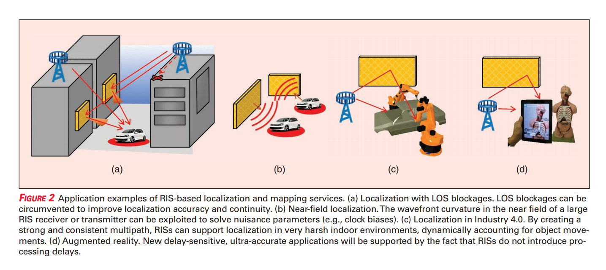

# 文献阅读整理

## 1 移动蜂窝网络定位技术综述

[@XuWeiYiDongFengWoWangLuoDingWeiJiShuZongShu]

移动通信系统越来越注重定位与通信相结合，以提高用户的空间感知能力。从信号结构层面提升定位性能，未来通信和定位结合将更加紧密。

## 2 基于灾后复杂环境的无线定位关键技术研究

[@HuAiHuaJiYuZaiHouFuZaHuanJingDeWuXianDingWeiGuanJianJiShuYanJiu2022]

现有技术手段无法实现广域灾后环境的高效定位

### 三个研究点

1. 优化布站：面向多变环境的定位系统几何构型优化方法
2. 节点选择：基于半定规划的灾后无线定位探测设备优选方法
3. 精准测距：基于DL-CTF的复杂环境定位信号测量方法

## 3 面向6G的高分辨率无线信道频域仿真方法及定位技术研究

[@LiYuanJieMianXiang6GDeGaoFenBianLuWuXianXinDaoPinYuFangZhenFangFaJiDingWeiJiShuYanJiu2021]

6G系统要求系统同步误差在1ns水平，但1ns的同步误差将会导致30cm的定位误差，通信能够容忍的同步误差在高分辨率定位要求下变得不可接受

## 4 Localization as a Service in Perceptive Networks: An ISAC Resource Allocation Framework

[]

主要讲定位和通信的资源分配

Similarly, different localization accuracy is required in diverse application scenarios. For instance, the important/dangerous targets (such as pedestrians) generally require high localization accuracy, whereas relatively low accuracy could be tolerable to the static and inanimate objects.
同样，不同的应用场景需要不同的定位精度。例如，重要/危险目标(如行人)通常需要较高的定位精度，而相对较低的精度对于静止和无生命的目标是可以容忍的。

## 5 Target Localization in ISAC System Based on BP Neural Network

[]

## 6 高精度定位新范式：通信定位一体化技术及应用

[]

每一代的定位精度都在不断提高，但现有的蜂窝网络在杂波环境中最多只能达到米级定位精度[2]，无法达到6G 扩展现实、智能交通、智能医疗等应用领域所要求的厘米级定位精度。

与传统无线定位方法相比，通信定位一体化设计具有两类增益[4]。一类是通信和定位通过共享有限的资源，如频谱、能源和硬件平台等，所带来的融合增益。另一类是通信和定位之间的协调增益。

四种定位性能指标

- 精度
  - MSE
  - 克拉美罗界
  - 韦斯-韦恩斯界
  - RMSE
- 精密度
  - 几何精度衰减因子
  - 定位误差中断率
  - 定位误差的累积分布函数
  - 覆盖范围

在未来6G 无线网络中，有望实现万物互联、万物智能、万物感知的愿景，通信能力与感知能力将融合共生。高精度的定位技术作为支撑未来通感融合的核心技术，将在6G 扮演重要角色。为了赋予6G 原生的支持通信和定位服务的能力，通信定位一体化技术作为一种全新的高精度定位范式将成为6G 技术与业务的主导趋势之一[24]。

通信定位一体化是指通过共享无线通信的基础设施和时、频、空间资源，在硬件架构和算法系统两个层面上实现通信和定位技术的高度集成。一体化打破了传统的通信或定位系统工作模式，在一个系统中同时实现高质量通信和高精度定位，实现了网络整体性能和业务能力的提升。通信定位一体化能够使得通信与定位互惠双赢。一方面无线通信与定位技术的深度融合，将为定位提供更多置信度信息，从而提升定位精度[22]。另一方面通过利用精确的位置信息，可对无线信道进行更准确的建模和预测，从而提高无线通信的性能[25]。

通信定位一体化

- 关键技术
  - 波形设计：从式(11) 和(12) 定位的角度来看，信号功率集中在频谱边缘能够获得更低的CRLB，即更高的定位精度。然而，在通信中为了减少符号间干扰和提高频谱利用率，信号波形通常被设计为功率集中在频谱的中心或主要部分。两者之间的差异表明，通信和定位的信号PSD 之间需要实际需求进行权衡。目前一体化波形的设计复杂度普遍较高，为了解决这个问题，需要研究复杂度更低的一体化波形实时设计方法。
  - 干扰消除
  - 杂波抑制
- 未来研究方向
  - RIS辅助定位
  - AI定位

## 7 智能超表面辅助6G通感算深度融合关键技术

作为感知的重要课题之一，首先聚焦于终端设备位置信息的获取。常见的定位算法需要将多个基站作为参考锚点，根据到达角、离开角、到达时间和接收信号强度等测量，结合参数化的观测模型以实现设备定位，**尤其依赖直射路径的存在**。然而，在移动通信场景中，由于复杂的电磁传播环境，直射路径可能被障碍物阻挡，相关定位算法无法工作。为此，考虑在系统中部署RIS以辅助实现定位。RIS 的大量反射单元使其具有较强的被动波束赋形能力，其反射波束的方向图具有较强的主瓣，能提供有效反射路径，克服对视距路径的依赖。**静态部署的多个RIS 可以替代多基站作为参考锚点，并且系统能融合多路测量实现单基站高精度定位**。

通过增加RIS 反射单元个数能有效提升定位精度，系统能达到厘米级别的定位精度。

此外，对于一般的目标检测类感知任务，RIS 的部署能有效扩大系统的感知范围。在复杂城市环境中，系统的目标检测能力同样局限于障碍物的阻挡，终端设备的感知范围往往较小。

此外，由于RIS 上配备了大量反射单元，其具有较高的角度分辨率及波束增益，这使得终端能接收较强的回波信号，更利于目标检测任务的完成。

## 8 Radio localization and mapping with reconfigurable intelligent surfaces: Challenges, opportunities, and research directions

## 9

The next sixth generation (6G) wireless technology isexpected to offer great opportunities for accurate wireless localization due to the very high carrier frequency (e.g.,in the millimeter wave (mmWave) band) and large antenn aarrays. However, although the millimeter scale wavelength renders massive antennas integratable on an antenna array withportable size [1], it also results in severe path loss especially in non-line-of-sight (NLoS) scenarios. Therefore, blockage is the key hinder to the large scale applications of accurate wireless localization systems operated in the mmWave band [2].
下一代第六代(6G)无线技术由于具有非常高的载波频率(例如，在毫米波(毫米波)频段)和大型天线阵列，预计将为精确的无线定位提供巨大的机会。然而，尽管毫米级波长使得大规模天线可以集成在便携尺寸的天线阵上[1]，但它也会导致严重的路径损耗，特别是在非视距(NLOS)情况下。因此，阻塞是工作在毫米波波段的精确无线定位系统大规模应用的关键障碍[2]。
